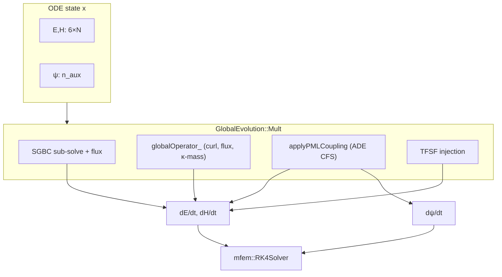

# Codebase architecture: PML in GlobalEvolution

## Executive summary

PML is added as a **dimension-agnostic extension** to the existing **split-operator** design of `GlobalEvolution`:

```
d/dt [E, H, ψ] = A_curl(E,H) + A_PML(E,H,ψ) + sources + SGBC/TFSF corrections
```

- **A_curl** → preassembled `globalOperator_` (mostly unchanged; κ may modify PML mass)
- **A_PML** → new `PMLOperator_` or inline coupling in `Mult()`
- **ψ** → extra ODE DOFs appended to `Fields::allDOFs()`

Only **GlobalEvolution** is modified for evolution physics. **MaxwellEvolution** / **HesthavenEvolution** are out of scope.

---

## Current GlobalEvolution data flow

### Construction (`GlobalEvolution::GlobalEvolution`)

1. SGBC face pairing, wrappers, `SGBCOperator_` if SGBC boundaries exist.
2. TFSF mapping / `TFSFOperator_` if planewave/dipole TFSF sources exist.
3. `ProblemDescription` + `DGOperatorFactory::buildGlobalOperator()` → **`globalOperator_`**.

`globalOperator_` size today:

```text
rows = 6 × ndofs
cols = 6 × (ndofs + num_face_nbr_dofs)
```

Blocks: Ex, Ey, Ez, Hx, Hy, Hz (see `GlobalIndices` in `DGOperatorFactory.h`).

### Time step (`GlobalEvolution::Mult`)

Order of operations today:

1. **SGBC sub-solve** (if active) — advances slab state; checkpointed around RK step in `Solver::step`.
2. Load `in` → `eOld_`, `hOld_`; exchange face neighbors.
3. Pack `multWorkVec_` with local + ghost DOFs.
4. **`globalOperator_->Mult(multWorkVec_, out)`** — main curl/flux/conductivity.
5. **TFSF** source injection via `applyTFSFSourceToVector`.
6. **SGBC flux injection** via `SGBCOperator_->Mult` pattern on boundary DOFs.

### State vector (`Fields`)

```cpp
all_dofs_.SetSize(6 * fes.GetNDofs());
// Layout: [Ex, Ey, Ez, Hx, Hy, Hz] each length ndofs
```

`Solver::step` → `odeSolver_->Step(fields_.allDOFs(), time_, dt)`.

### Time integration classes

| ODE type | Mechanism |
|----------|-----------|
| RK4 (default) | **`Mult()` only** |
| SDIRK / Backward Euler | **`ImplicitSolve()`** — currently assumes `n == 6*ndofs`, builds `(I - dt*A)` from **entire** `globalOperator_` |

Milestone A: **RK4 + extended `Mult()`** only.

---

## Required architectural changes

### 1. Extended `TimeDependentOperator` size

Today:

```cpp
TimeDependentOperator(6 * fes.GetNDofs())
```

Target:

```cpp
TimeDependentOperator(6 * ndofs + n_aux)
```

where **`n_aux = 0`** if model has no PML materials.

`GlobalEvolution::Mult` must accept `in.Size() == out.Size() == 6*ndofs + n_aux`.

**Hard-coded 6× assumptions to fix:**

| Location | Issue |
|----------|-------|
| `GlobalEvolution.cpp` ~924 | `out.SetSize(6 * ndofs)` |
| `GlobalEvolution.cpp` ~1220 | `MFEM_ASSERT(n == 6 * ndofs)` in `ImplicitSolve` |
| `Fields.h` | `all_dofs_.SetSize(6 * ndofs)` only |
| `ProbesManager` | Must continue reading **first 6× block only** |

### 2. New types: `PMLProperties` and model storage

Add to `Model` (parallel to `SGBCProperties`):

```cpp
struct PMLProperties {
    std::vector<GeomTag> geom_tags;
    bool matches_vacuum = true;
    int grading_order = 3;
    double target_reflection = 1e-6;
    double kappa_max = 1.0;
    double alpha_max = 0.0;
    std::set<Direction> active_axes;  // parsed from JSON ["X","Y","Z"]
};
```

Storage: `std::vector<PMLProperties> pml_regions_` or map tag → properties.

**Element classification:**

- `bool is_pml_element[el]` or attribute → PML lookup
- Precomputed QP tables: `kappa, sigma, alpha` per direction at quadrature points

### 3. `PMLAuxLayout` (DOF mapping)

Responsible for:

- `n_aux` total count
- Offset of ψ block in `allDOFs`: `[0 .. 6N-1]` = E/H, `[6N .. 6N+n_aux-1]` = ψ
- Mapping `(element, qp, direction, aux_index) → global aux DOF index`
- Mark which **field DOFs** lie in PML elements (for coupling sparsity)

Must be **dimension-agnostic**: built from mesh dimension and `active_axes` only.

### 4. Operator split

#### Tier A — `globalOperator_` (existing factory)

- **Vacuum elements:** unchanged.
- **PML elements:** if κ ≠ 1, modify entries in `buildEpsMuPiecewiseVector(E/H)` for those attributes (κ_d affects effective material along stretched axes — exact tensor form from paper).
- **Do not** add PML σ via `buildSigmaPiecewiseVector()`.

#### Tier B — `PMLOperator_` (new)

Sparse operator or structured element kernels implementing:

- **ψ̇** = f(E, H, ψ) with α, σ profile coefficients
- **E/H correction** += g(ψ, profiles)

Applied in `Mult()` **after** `globalOperator_->Mult`, **before** TFSF (order may matter; document chosen order in implementation).

Suggested signature pattern:

```cpp
void applyPMLCoupling(const mfem::Vector& in, mfem::Vector& out) const;
// in, out: full extended vector; only writes PML element rows + all ψ rows
```

Alternative: assemble `PMLOperator_` as `SparseMatrix` and call `PMLOperator_->Mult(in, pml_out)` then add into `out`.

#### Tier C — sources, SGBC, TFSF

**No change** to structure; they act on E/H blocks only. User constraint: PML regions do not overlap SGBC/TFSF faces.

---

## Dimension-agnostic pattern (mandatory)

Mirror `DGOperatorFactory`:

```cpp
const int dim = fes_.GetMesh()->Dimension();
for (Direction d = X; d <= Z; ++d) {
    if (d >= dim) continue;
    if (!active_axes.contains(d)) continue;
    // PML stretch / aux for direction d
}
```

**Inactive components:** Ey, Ez may exist in state for 1D mesh but curl operators already zero inactive derivatives via `d >= dim` guards.

**1D validation mesh:** `Dimension() == 1`, `active_axes: ["X"]` — same code path as 2D corner PML.

---

## What NOT to do (SGBC anti-pattern)

| SGBC volumetric/surface | Volumetric PML |
|-------------------------|----------------|
| Separate sub-mesh + sub-solver | Same mesh, same `GlobalEvolution` |
| `commitSGBCCheckpoint` / `finalizeSGBCStep` | ψ in main ODE state |
| Flux injection after sub-step | ψ updated every RK **`Mult()`** stage |
| `SGBCWrapper::solve` inner time loop | No inner loop for PML |

---

## `VolumetricRegionSubMesher` status

**Exists** in `SubMesher.h/cpp` — splits vacuum/PML submeshes and detects interfaces.

**Milestone A decision:** **Do not require** for physics. Optional uses:

- Debug logging of interface face counts
- Future TF/SF splitting across vacuum/PML

**Depth computation** should use **element attribute + face neighbor walk** on the full mesh.

---

## Files expected to change (implementation)

### New files

| File | Role |
|------|------|
| `src/components/PMLProperties.h` | Struct + profile evaluation helpers |
| `src/components/PMLProperties.cpp` | Depth/profiles at QPs |
| `src/components/PMLAuxLayout.h` | Extended DOF layout |
| `src/mfemExtension/PMLIntegrators.h` (optional) | Domain integrators for ψ coupling |

### Modified files

| File | Changes |
|------|---------|
| `src/components/Model.h/cpp` | Store PML regions; queries `hasPML()`, `getPMLProperties()` |
| `src/driver/driver.cpp` | Parse `"type":"PML"`, `"type":"vacuum"`; **remove SBC_PML** |
| `src/evolution/Fields.h` | Extended `all_dofs_` size; accessor for ψ block |
| `src/evolution/GlobalEvolution.h/cpp` | Extended operator size; `PMLOperator_`; `applyPMLCoupling` |
| `src/components/DGOperatorFactory.h` | κ-modified mass; optional `buildPMLOperator` |
| `src/solver/Solver.cpp` | Pass extended size to ODE; probes unchanged |
| `README.md` | Document volumetric PML JSON; remove SBC_PML |

### Deferred

| File | Reason |
|------|--------|
| `src/evolution/GlobalEvolution.cu` | GPU Milestone B |
| `GlobalEvolution::ImplicitSolve` | Milestone B (SDIRK) |

---

## Coexistence matrix

| Feature | PML interaction |
|---------|-----------------|
| SGBC | Orthogonal regions; no shared boundary tags in user cases |
| TFSF / planewave | Orthogonal; sources in vacuum/TF region |
| `bulk_conductivity` materials | Allowed in non-PML tags only |
| Interior boundaries (PEC/PMC/SMA) | Standard; vacuum–PML interior faces are **not** special boundary conditions |
| Probes | Sample E/H only |
| MOR / exporter | E/H only |

---

## Memory and performance (Milestone A)

- **n_aux** scales with (PML DOFs × active directions × aux per direction). Expect increase over 6N only in PML region.
- Profile tables stored at init — **not** recomputed each `Mult()`.
- Serial CPU only; no OpenMP requirement for PML initially.

---

## Diagram


