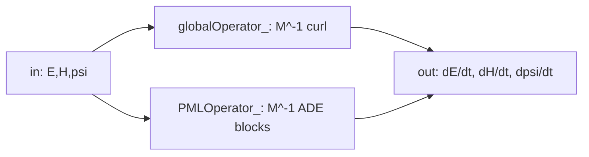
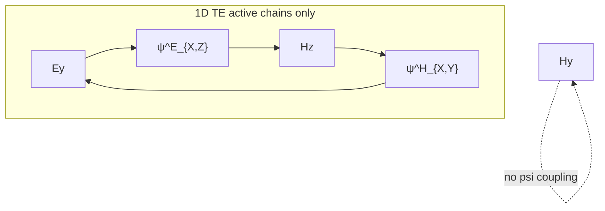

# Session record — 2026-05-27

Implementation log for the PML physics work completed on **2026-05-27** on branch **`vol_pml`**. Reference case: [`testData/maxwellInputs/1D_PML/`](../../testData/maxwellInputs/1D_PML/).

**End-of-day status:** Milestone **A.5 complete** (factory ADE CFS-CPML operator wired and verified). Milestone **A.6 partially verified** — case runs to `final_time = 12`, bulk Ey/Hz absorption looks good, Hy spurious mode eliminated; user DFT (−40 dB) and late-time noise at the outer SMA edge remain open.

---

## Mesh and case geometry

| Item | Tag | Location |
|------|-----|----------|
| Vacuum | vol 1, 2 | x ∈ [−3, −2.5] and [−2.5, 2] |
| PML | vol 3 | x ∈ [2, 3] (10 elements) |
| SMA | bdr 1, 2 | x = −3, x = 3 |
| TFSF planewave | bdr 3 | x = −2.5 (Ey, +x propagation) |
| Delimiter (mesh only) | bdr 4 | x = 2 — not in JSON |

Active stretch: **`active_axes: ["X"]`** only. PML parameters in JSON: `kappa_max = 1.0`, `alpha_max = 0.0`, `grading_order = 4`, `target_reflection = 1e-6`.

Solver settings used for verification: `time_step = 0.001`, `final_time = 12.0`, `order = 2`.

---

## Continuous physics (Gedney ADE CFS-CPML)

Primary reference: Gedney & Zhao 2010, DOI [10.1109/TAP.2009.2037765](https://doi.org/10.1109/TAP.2009.2037765). Full transcription in [`01-physics-and-formulation.md`](./01-physics-and-formulation.md).

### dgtd curl convention (normalized vacuum)

\[
\frac{\partial \mathbf{E}}{\partial t} = \nabla \times \mathbf{H}, \qquad
\frac{\partial \mathbf{H}}{\partial t} = -\nabla \times \mathbf{E}
\]

### Component-indexed auxiliary evolution (per stretch direction \(d\), component \(c\))

\[
\frac{\partial \psi^E_{d,c}}{\partial t} = -\alpha_d\,\psi^E_{d,c} + \sigma_d\,\mathcal{D}_d(\mathbf{E})
\]

\[
\frac{\partial \psi^H_{d,c}}{\partial t} = -\alpha_d\,\psi^H_{d,c} + \sigma_d\,\mathcal{D}_d(\mathbf{H})
\]

where \(\mathcal{D}_d(\mathbf{F})\) is the curl-coupled directional driver: at each DOF, the linear combination of \(\partial F_{c'}/\partial x_d\) with weights from the Maxwell curl table (only components whose curl row contains \(\partial/\partial x_d\)).

### Field corrections (after `globalOperator_->Mult`)

\[
\frac{\partial E_c}{\partial t} \mathrel{+}= \sum_{d \in \text{active}} \frac{\psi^H_{d,c}}{\kappa_d}, \qquad
\frac{\partial H_c}{\partial t} \mathrel{-}= \sum_{d \in \text{active}} \frac{\psi^E_{d,c}}{\kappa_d}
\]

At the vacuum–PML interface (\(\sigma = \alpha = 0\), \(\kappa = 1\)) corrections vanish.

### Semidiscrete transcription in code

Each block in `PMLOperator_` is assembled as **`M^{-1} × weak operator`**, matching `globalOperator_`:

\[
\dot{\psi}^E_{d,c} = M^{-1}_{\text{scalar}}\left(-\alpha_d\,\psi^E_{d,c} + \sigma_d\,\mathcal{D}_d^{\text{disc}}(E)\right)
\]

\[
\dot{\psi}^H_{d,c} = M^{-1}_{\text{scalar}}\left(-\alpha_d\,\psi^H_{d,c} + \sigma_d\,\mathcal{D}_d^{\text{disc}}(H)\right)
\]

\[
\dot{E}_c \mathrel{+}= M^{-1}_E \frac{\psi^H_{d,c}}{\kappa_d}, \qquad
\dot{H}_c \mathrel{-}= M^{-1}_H \frac{\psi^E_{d,c}}{\kappa_d}
\]

\(\mathcal{D}_d^{\text{disc}}\) = marked volume derivative (`buildPMLDomainDerivativeSubOperator`) **plus** marked interior one-normal face jump (`buildPMLDomainOneNormalSubOperator`), with **SBP split**: volume **+w**, face **−w** on the same field column (`collectPMLComponentDriverBlocks`).

---

## Phase 1 — Factory `PMLOperator_` (replaces manual `PMLOperator`)

### Problem

The original [`PMLOperator.cpp`](../../src/evolution/PMLOperator.cpp) used hand-rolled element Galerkin loops with local mass inverses. On the first RK stage this produced **NaN** (`inv × 0 = NaN` on PML elements). Even when stable, fields showed **no absorption** — PML acted like vacuum because integrators lacked the global **`M^{-1}`** rate formulation and DG alignment.

### Solution

Pivot to the same architecture as `globalOperator_`, `TFSFOperator_`, and `SGBCOperator_`:



1. **`DGOperatorFactory::buildPMLOperator(PMLAuxLayout)`** — assembles extended CSR matrix via `collectPMLOperatorBlocks` + `mergeBlocksToCSR`.
2. **`GlobalEvolution::applyPMLCoupling`** — packs `pmlWorkVec_` (field + ghost + ψ), calls `PMLOperator_->AddMult`.
3. **`Model::buildPMLVolumeMarker()`** — restricts all PML domain integrators to tagged elements.
4. **`PMLProfileCoefficient`** — evaluates \((\sigma, \alpha, \kappa)\) at quadrature points from init-time profile tables.

### Removed

- [`PMLOperator.cpp`](../../src/evolution/PMLOperator.cpp) / [`PMLOperator.h`](../../src/evolution/PMLOperator.h)
- Debug instrumentation and host-pointer workarounds in `GlobalEvolution::Mult`

### Initial scalar-ψ layout (superseded same day)

First factory version used **`n_aux = 2 × ndofs × n_stretch`** (one ψ^E and one ψ^H block per stretch direction). Extended ODE size was **1440** (1080 field + 360 aux) on the 1D mesh. This layout was replaced by vector-component ψ in Phase 3.

---

## Phase 2 — PML instability fix (volume + face ψ driver)

### Problem

When the planewave entered the PML (x ≈ 2–3), the simulation **blew up** or showed runaway high-frequency growth. The ψ driver used **volume-only** \(\partial/\partial x_d\); the global DG Maxwell curl uses **volume derivative + interior one-normal face fluxes** (`collectGlobalDirectionalOperators` + `collectGlobalOneNormalOperators`).

### Implementation

| Component | File | Role |
|-----------|------|------|
| `MaxwellDGCoefficientOneNormalJumpIntegrator` | [`BilinearIntegrators.cpp`](../../src/mfemExtension/BilinearIntegrators.cpp) | σ-weighted one-normal face jump (σ = max on both face sides) |
| `buildPMLDomainOneNormalSubOperator` | [`DGOperatorFactory.h`](../../src/components/DGOperatorFactory.h) | PML interior faces only; excludes SMA/PEC boundary faces |
| `collectPMLStretchDriverBlocks` → `collectPMLComponentDriverBlocks` | [`DGOperatorFactory.h`](../../src/components/DGOperatorFactory.h) | σ-weighted volume + face; SBP **+w** vol, **−w** face on same column |
| Maxwell `MInv[E/H]` on field←ψ corrections | [`DGOperatorFactory.h`](../../src/components/DGOperatorFactory.h) | Aligns units with `globalOperator_->Mult` |
| Scalar `MInv` on ψ rows | same | Auxiliary mass and driver rows |
| Assembly diagnostics | `buildPMLOperator` rank-0 print | `driver_vol_nnz`, `driver_face_nnz`, `corr_nnz` |

**Debug note:** A cross-column face placement pattern (matching `collectGlobalOneNormalOperators` row layout) was tried during development and **reverted**; the stable choice is same-column opposite sign (SBP split).

### Assembly example (1D mesh, vector ψ, after Phase 3)

```
[PML] PMLOperator_ assembled: 2160 x 2160, nnz=936, stretch_dirs=1,
      driver_vol_nnz=360, driver_face_nnz=432, corr_nnz=360
```

---

## Phase 3 — Vector-component ψ (fix spurious Hy)

### Problem

After Phase 2, Ey and Hz damped in the PML, but **Hy appeared** inside the PML and propagated **backward** toward the vacuum entrance — unphysical for 1D TE (+x, Ey + Hz only). Global Maxwell keeps Hy at zero because Hy is driven only by Ez (\((\nabla \times \mathbf{E})_y\) contains \(\partial_x E_z\)), and Ez ≡ 0.

**Root cause:** Scalar ψ^E shared one DOF block across all H rows. Ey-driven memory incorrectly fed **`H_y ← ψ^E`** via the 3D curl table entry for \(\partial_x E_z\), a coupling path that does not exist when Ez = 0.

### Layout change

\[
n_{\text{aux}} = 6 \times n_{\text{dofs}} \times n_{\text{stretch\_dirs}}
\]

Per stretch slot \(d\):

```text
[ Ex..Hz (6×N) | ψ^E_{d,X} (N) | ψ^E_{d,Y} (N) | ψ^E_{d,Z} (N) | ψ^H_{d,X} (N) | ψ^H_{d,Y} (N) | ψ^H_{d,Z} (N) | (next d …) ]
```

Only component pairs with a nonzero curl entry receive `PMLOperator_` blocks; uncoupled slots stay at zero.

### 1D TE active coupling (stretch X)



| Block | Driver column | Output row |
|-------|---------------|------------|
| ψ^E_{X,Z} | Ey | Hz correction |
| ψ^H_{X,Y} | Hz | Ey correction |

### New APIs

| API | File |
|-----|------|
| `psiEOffset(stretch_d, h_comp)`, `psiHOffset(stretch_d, e_comp)` | [`PMLAuxLayout.h`](../../src/components/PMLAuxLayout.h) |
| `pmlPsiEComponentActive`, `pmlPsiHComponentActive` | [`PMLDGHelpers.h`](../../src/components/PMLDGHelpers.h) |
| `pmlPsiEDriverCoupling`, `pmlPsiHDriverCoupling` | [`PMLDGHelpers.cpp`](../../src/components/PMLDGHelpers.cpp) |

Factory loops each `(stretch_d, component c)` independently: one ψ block ↔ one driver column ↔ one field correction row.

### Runtime

[`GlobalEvolution::applyPMLCoupling`](../../src/evolution/GlobalEvolution.cpp) packs `6 * blockSize + n_aux` into `pmlWorkVec_`. Rank-0 `[PML Mult diag]` scans **active component blocks** only for max |ψ| and max |dψ/dt|.

---

## Files touched (by phase)

| Phase | Files |
|-------|-------|
| **1 — Factory operator** | `DGOperatorFactory.h`, `GlobalEvolution.cpp/.h`, `Model.cpp/.h`, `PMLCoefficients` / `PMLProfileCoefficient`, `evolution/CMakeLists.txt`; **deleted** `PMLOperator.cpp/.h` |
| **2 — Face driver** | `BilinearIntegrators.h/.cpp`, `DGOperatorFactory.h`, `docs/pml/04-implementation-plan.md` |
| **3 — Vector ψ** | `PMLAuxLayout.h/.cpp`, `PMLDGHelpers.h/.cpp`, `DGOperatorFactory.h`, `GlobalEvolution.cpp`, `docs/pml/01-physics-and-formulation.md`, `docs/pml/04-implementation-plan.md` |
| **Case config** | `testData/maxwellInputs/1D_PML/1D_PML.json` |

---

## Verification summary (`1D_PML`, dt = 0.001, t = 12)

| Metric | Before today's fixes | After vector ψ |
|--------|---------------------|----------------|
| ODE size | 1440 (1080 + 360 aux) | **2160** (1080 + **1080** aux) |
| `n_aux` | 360 | **1080** |
| max \|ψ\| at t = 12 | ~950 (scalar) / blow-up pre-face | **~2.4** |
| Hy at vacuum probe | Grew, traveled backward | **0** |
| Ey / Hz absorption | Partial / unstable | **Good** (user confirmed visually) |
| `1D_PEC` regression | — | Unchanged (`n_aux = 0`) |
| Late-time artifact | — | Small HF ringing **pinned at SMA x = 3** (outer PML edge) |

Command:

```bash
./build/gnu-release-mpi/bin/opensemba_dgtd -i testData/maxwellInputs/1D_PML/1D_PML.json
```

---

## Config deviations from original A.6 plan draft

| Field | Plan draft | Actual [`1D_PML.json`](../../testData/maxwellInputs/1D_PML/1D_PML.json) |
|-------|------------|-----------------------------------------------------------------------------|
| `time_step` | 0.01 | **0.001** (explicit stability in high-σ PML) |
| probe exporter | `"steps": 200` | **`"saves": 120`** |
| boundaries | single entry `tags: [1, 2]` | **two entries** (tag 1, tag 2 separately) |
| `n_aux` expectation | 360 (scalar ψ) | **1080** (vector ψ) |

---

## Known open items (resume next session)

1. **A.6 user DFT** — offline DFT on vacuum probes at x = −2.75 and x = 1.0; target **−40 dB** reflection ([`05-verification.md`](./05-verification.md)).
2. **Late-time SMA edge noise** (x = 3) — localized HF artifact grows over time at outer PML termination. Likely contributors: **`alpha_max = 0`** (no ψ damping), high σ in outermost PML cells, SMA + explicit RK4. **Not** primarily κ (`kappa_max = 1` in current JSON). Try small `alpha_max > 0` smoke test; Milestone B SDIRK if stiff.
3. **IBFI at vacuum–PML** (x ≈ 2) — deferred; pursue only if DFT shows reflection at the interface after above tuning.
4. **κ in PML mass** — deferred until `kappa_max > 1` is needed.
5. **Gedney equation numbers** in `01-physics-and-formulation.md` — still on open checklist.

---

## Cursor plans completed today

| Plan | Outcome |
|------|---------|
| `factory_pmloperator_matrix` | Factory `PMLOperator_` wired; scalar ψ layout later superseded |
| `fix_pml_instability` | Volume + face ψ driver, SBP split, Maxwell MInv on corrections |
| `vector_pml_auxiliaries` | Component-indexed ψ; Hy bug fixed |
| `fix_pml_ade_mult` | **Superseded** by factory plan (manual operator removed) |

---

## Suggested resume prompt

> Read `docs/pml/09-session-record-2026-05-27.md` and `docs/pml/04-implementation-plan.md`. Continue A.6: user DFT, then address late-time SMA-edge noise (`alpha_max` sweep or Milestone B SDIRK).
