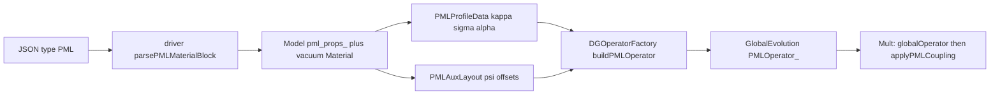

# PML pipeline re-exploration (tracking document)

**Date:** 2026-09-04  
**Scope:** Audit only — no solver, JSON, or mesh changes.  
**Purpose:** Single static memory of what volumetric CFS-CPML is supposed to do, how it is wired in the live code, what it does instead, and why late-time growth appears at the outer PML boundary. Future sessions should read this before re-litigating signs, SMA, or marker-based curl splits.

**Sources:** Design docs [`00`](./00-decisions-locked.md)–[`08`](./08-conversation-snapshot.md), session logs [`09`](./09-session-record-2026-05-27.md)–[`15`](./15-session-operator-duplicate-audit.md) and [`17`](./17-session-centered-frame-probe-correlation.md)–[`19`](./19-session-sign-matrix-interface-window.md) (there is **no** `16` file), and the live `src/` path as of this write-up.

---

## 1. What PML is supposed to be

### Physical role

Open domains must be truncated. A **Perfectly Matched Layer (PML)** is a volumetric absorber: inside tagged elements, real coordinates are replaced by **complex-stretched** coordinates so outgoing waves decay exponentially. In the continuous model with ideal profiles, the interface with the physical (vacuum) domain remains **reflectionless**.

### Formulation (locked)

| Choice | Value |
|--------|-------|
| Type | **Volumetric ADE CFS-CPML** |
| Primary reference | Gedney & Zhao, IEEE TAP 2010, DOI [10.1109/TAP.2009.2037765](https://doi.org/10.1109/TAP.2009.2037765) |
| Secondary | Taflove CPML (stretch intuition only — **not** FDTD stencils) |
| Solver path | **`GlobalEvolution` only** |
| Time integration (Milestone A) | Explicit **RK4** via `Mult()` for E, H, **and** ψ |
| Not used | Berenger split-field, FDTD recursive convolution, surface `SBC_PML`, bulk Ohmic `Material::sigma_` |

CFS stretch in direction \(d\):

\[
s_d = \kappa_d + \frac{\sigma_d}{\alpha_d + j\omega}
\]

| Parameter | Role |
|-----------|------|
| \(\kappa_d \ge 1\) | Scaling / slowing along stretch |
| \(\sigma_d \ge 0\) | Absorption; grows with depth into PML |
| \(\alpha_d \ge 0\) | Frequency shift; late-time CFS stabilization; **\(\alpha = 0\)** = classical PML |

**Interface matching (mandatory):** at depth \(\rho = 0\) (vacuum–PML face), \(\kappa = 1\), \(\sigma = 0\), \(\alpha = 0\).

ADE introduces auxiliary memory variables **ψ** so convolution is replaced by first-order ODEs that ride the same RK4 stages as the fields. Exact Maxwell ADE transcription used by the project is in [`01-physics-and-formulation.md`](./01-physics-and-formulation.md).

### Acceptance

- **−40 dB** reflected vs incident in frequency domain from **vacuum** probes (user DFT offline).
- JSON `target_reflection` (e.g. `1e-6`) is a **design** grading target (−60 dB), not the acceptance gate.
- ψ is **never** exported to ParaView / probes.

---

## 2. How it is defined (mesh + JSON)

**Principle:** the mesh owns geometry and thickness; JSON owns material type and grading law. There is **no** required `pml_thickness` field.

### Workflow

1. Gmsh: vacuum + PML volumes with Physical Volume / attribute tags  
2. JSON: `"type": "vacuum"` or `"type": "PML"` with stretch parameters  
3. Init: depth \(\rho_d\) from mesh geometry → \(\kappa, \sigma, \alpha\) at quadrature points  
4. Run: probes in vacuum; DFT offline for −40 dB  

### JSON PML block (live parser)

Parsed in [`src/components/PMLProperties.cpp`](../../src/components/PMLProperties.cpp) / `parsePMLMaterialBlock`:

| Field | Semantics |
|-------|-----------|
| `tags` | Gmsh volume attribute IDs |
| `type` | `"PML"` |
| `matches_vacuum` | Must be true → ε = μ = 1; no bulk Ohmic loss |
| `grading_order` | Power-law exponent \(m\) |
| `target_reflection` | Design \(R\) used to set \(\sigma_{\max}\) |
| `kappa_max` | Max κ at outer edge (≥ 1); cases use **1.0** |
| `alpha_max` | Max CFS α; cases use **0.0** (classical limit) |
| `active_axes` | Subset of `"X"`, `"Y"`, `"Z"` for that tag block |

**Forbidden on PML tags:** `bulk_conductivity`, relative ε/μ (unless later allowed).

### Profile law (live code)

[`src/components/PMLProfiles.cpp`](../../src/components/PMLProfiles.cpp) `evaluateStretchProfiles`:

\[
\xi = \mathrm{clamp}(\rho / L, 0, 1),\quad
\kappa = 1 + (\kappa_{\max}-1)\xi^m,\quad
\alpha = \alpha_{\max}\xi^m
\]

\[
\sigma_{\max} = -\frac{(m+1)\ln(R_{\mathrm{target}})}{2L},\quad
\sigma = \sigma_{\max}\xi^m
\]

\(L\) = PML thickness along the stretch axis from **mesh extent**, not JSON.

### Outer boundary types

Vacuum–PML interface = **interior face** (never a BC tag).

Where the outermost PML element meets \(\partial\Omega\):

| JSON `type` | Effect |
|-------------|--------|
| `SMA` | Standard absorbing BC on that tag (baseline `1D_PML`) |
| `PEC` | Mirror BC (Gedney-style PEC-backed slab experiments) |
| `PML_NONE` | No boundary face integrators on that tag |

### Reference cases

| Case | Role |
|------|------|
| [`1D_PML/`](../../testData/maxwellInputs/1D_PML/) | Baseline: upwind α=1, SMA @ ±3, PML tag 3 on \(x\in[2,3]\), TFSF @ −2.5, `alpha_max=0`, `dt=0.001`, `final_time=20` |
| [`1D_PML_centered/`](../../testData/maxwellInputs/1D_PML_centered/) | Same mesh, `upwind_alpha=0` |
| [`1D_PML_PEC/`](../../testData/maxwellInputs/1D_PML_PEC/) | Outer PEC |
| [`1D_PML_PML_NONE/`](../../testData/maxwellInputs/1D_PML_PML_NONE/) | Outer `PML_NONE` |
| [`1D_PML_buffer/`](../../testData/maxwellInputs/1D_PML_buffer/) (+ `_centered`) | Vacuum buffer past PML; SMA farther out |
| [`1D_PML_dtHalf/`](../../testData/maxwellInputs/1D_PML_dtHalf/) | `dt=0.0005` |
| [`2D_RCS_Circle_Vol_PML/`](../../testData/maxwellInputs/2D_RCS_Circle_Vol_PML/) | Structural JSON / multi-axis corners (not yet −40 dB validated) |

Stability probes on many 1D cases: **x = 1.99 / 2.01 / 2.99** (interface + near-outer). DFT layout in [`05-verification.md`](./05-verification.md) still mentions −2.75 / 1.0 (PointProbe0 at −2.75 was observed zero upstream of TFSF).

**Time units:** `final_time: 20` is **normalized code time** (≈ 66.7 ns in SI export via \(c_{\mathrm{SI}}\)). Do not treat “20 s” as SI seconds.

---

## 3. How it is engaged in code (data flow)



### End-to-end

1. **Parse** — [`src/driver/driver.cpp`](../../src/driver/driver.cpp) `assembleAttributeToMaterial`: `"type":"PML"` → `parsePMLMaterialBlock`; each tag also inserted into `gt2m` as **vacuum** Material (ε=μ=1, σ_bulk=0). Stretch lives only in `pml_props`.
2. **Model** — [`Model.h`](../../src/components/Model.h) / `.cpp`: `setPMLProperties`, `initializePMLProfiles`, `initializePMLAuxLayout`, `buildPMLVolumeMarker`. Driver may init profiles at default FE order; **Solver rebuilds** with `opts.evolution.order`.
3. **Profiles** — [`PMLProfiles.cpp`](../../src/components/PMLProfiles.cpp): attribute maps, one global interface per axis, QP κ/σ/α.
4. **Aux layout** — [`PMLAuxLayout.cpp`](../../src/components/PMLAuxLayout.cpp): \(n_{\mathrm{aux}} = 6 \times n_{\mathrm{dofs}} \times n_{\mathrm{stretch\_dirs}}\); blocks \(\psi^E_{d,c}\), \(\psi^H_{d,c}\).
5. **Fields** — [`Fields.h`](../../src/evolution/Fields.h): `allDOFs = [E,H (6N) | ψ (n_aux)]`. GridFunctions / probes / ParaView = first 6N only.
6. **Operator** — [`DGOperatorFactory.h`](../../src/components/DGOperatorFactory.h) `buildPMLOperator` / `collectPMLOperatorBlocks`.
7. **Evolution** — [`GlobalEvolution.cpp`](../../src/evolution/GlobalEvolution.cpp):
   - Ctor: `TimeDependentOperator(6N + n_aux)`; builds `PMLOperator_`.
   - `Mult`: (optional SGBC) → pack E/H work vec → `globalOperator_->Mult` → **`applyPMLCoupling`** → TFSF → SGBC flux.
   - `applyPMLCoupling`: pack `[fields from multWorkVec | ψ from in]` → `PMLOperator_->AddMult(..., sign)`.

### Cleanup / deferred status

| Item | Live status |
|------|-------------|
| `SBC_PML` | **Gone** from `src/` ([`06-cleanup-inventory.md`](./06-cleanup-inventory.md) checkboxes are stale) |
| `VolumetricRegionSubMesher` | Exists; **not** used by evolution |
| `ImplicitSolve` | **Aborts** if `total_state_size_ > 6*ndofs` (no PML + SDIRK yet) |
| GPU / MPI PML | Out of scope Milestone A |

### Diagnostic env knobs (still in tree)

| Env | Effect |
|-----|--------|
| `PML_OPERATOR_AUDIT=1` | Assembly / Mult audit logs, CSR helpers |
| `PML_EXPORT_AUDIT_CSR=1` | Export audit CSR |
| `PML_SKIP_GLOBAL=1` | Skip `globalOperator_->Mult` |
| `PML_SKIP_PML=1` | Skip `applyPMLCoupling` |
| `PML_MULT_PROBE=1` | Unit probes at construction |
| `PML_SIGN_TEST=0..7` | Sign / face layout experiments (see §6) |

Always-on (rank 0): Mult diag every 500 calls — `max|psi|`, outer vs inner, etc.

---

## 4. Operator split: intended vs live

### Intended (design docs)

```
d/dt [E, H, ψ] = A_curl(E,H) + A_PML(E,H,ψ) + sources
```

- `globalOperator_` — unstretched curl + DG flux (+ κ-mass when `κ_max>1`; **deferred**, cases use `κ_max=1`)
- `PMLOperator_` — ADE: \(\dot\psi = -\alpha\psi + \sigma\,\mathcal{D}_d(\cdot)\); field corrections \(\pm\psi/\kappa\)
- Vacuum–PML: standard interior DG flux; stretch zero at interface
- Outer: SMA (or experiment) on \(\partial\Omega\); ψ termination per Gedney, **not** bulk Ohmic σ

### Live (code)

| Piece | Behavior |
|-------|----------|
| `globalOperator_` | **Full Maxwell curl + DG flux everywhere**, including PML volume |
| `PMLOperator_` | **Adds** σ-weighted volume \(\partial_d\) + interior-face SBP (same-column −w) into ψ; `−α ψ` (dead when `alpha_max=0`); field corrections `Ė += ψ^H/κ`, `Ḣ −= ψ^E/κ` |
| Upwind | If `upwind_alpha>0`, also σ-scaled Zero/Two-normal blocks on **PML-marked** faces |
| Outer ψ faces | Default: **none**. Mode `PML_SIGN_TEST=7` can add terminating bdr faces (worsened t=20) |
| Inverse mass | ψ rows: **global scalar** `M⁻¹` (`buildPMLScalarInverseMassSubOperator` **ignores** `pml_marker`); field corrections: Maxwell `M⁻¹[E/H]` |

This is the documented **duplicate-curl** architecture: stretch derivatives appear both in the global curl and again (σ-weighted) in the ψ driver. Naive removals were tried and **reverted** (§6).

### ADE mapping (default signs)

Per active stretch direction \(d\):

\[
\partial_t \psi^E_d = -\alpha_d\,\psi^E_d + \sigma_d\,\mathcal{D}_d(\mathbf{E}),\quad
\partial_t \psi^H_d = -\alpha_d\,\psi^H_d + \sigma_d\,\mathcal{D}_d(\mathbf{H})
\]

\[
\partial_t E_c \mathrel{+}= \sum_d \psi^H_{d,c}/\kappa_d,\quad
\partial_t H_c \mathrel{-}= \sum_d \psi^E_{d,c}/\kappa_d
\]

1D TE (`active_axes: ["X"]`): wired couplings are essentially \(\psi^E_{X,Z}\leftrightarrow E_y\leftrightarrow H_z\) and \(\psi^H_{X,Y}\leftrightarrow H_z\leftrightarrow E_y\); see [`PMLDGHelpers`](../../src/components/PMLDGHelpers.cpp).

---

## 5. What it does instead (observed behavior)

### Healthy window (pulse transit)

On baseline `1D_PML` / centered:

| Phase | Approx. \(t_{\mathrm{code}}\) | Observation |
|-------|-------------------------------|-------------|
| Incidence / enter PML | ~3.5–7.5 | Fields O(1); `max|ψ|` rises to ~2.4 |
| Interface peak | ~6.8–7.5 (ParaView cycles ~68–75) | Centered ≈ upwind at probes 1.99/2.01; **clean** transit |
| Mid absorption | ~7.5–12 | Visual decay in layer; Hy stays 0 (post vector-ψ fix) |
| Crude reflection (session 10) | late window on probe @ 1.0 | Peak ratio looked ≪ −40 dB — **DFT never signed off** |

### Late-time instability

After the pulse has left the layer, **ψ-led exponential growth** starts in the **outermost PML cells** (near the designated outer boundary, \(x\approx 3\) on the baseline mesh), then contaminates E/H and eventually vacuum probes.

Baseline `1D_PML` (`dt=0.001`, `alpha_max=0`, upwind):

| ~\(t_{\mathrm{code}}\) | Mult call | `max|ψ|` |
|------------------------|-----------|----------|
| 7.5 | 30000 | ~2.4 |
| 11.25 | 45000 | ~0.17 (lull) |
| **13.75** | **55000** | **~1417 (onset)** |
| 20 | 80000 | ~\(10^{13}\) (later ~\(10^{27}\) after ψ Zero/Two upwind added) |

Centered flux **delays** onset (~cycle 167 vs ~101 for probe gate failure) but still **fails** at `t=20` (`max|ψ| ~ 6\times10^4`, probes ~\(10^3\)).

**Spatial reading (compatible across sessions):**

- First seed on baseline mesh = **outer PML / designated outer boundary**, not the vacuum–PML interface.
- Interface transit epoch is physically healthy.
- Buffer cases delocalize growth (SMA moved off the PML face) but still blow up.
- Once ψ runs away, energy spreads back into vacuum (probes 1.99 fail later).

User symptom (“grows unstable from the PML designated boundary after some seconds”) matches this record: seconds of wall/code time after a healthy absorption phase, seeded at the outer PML termination.

---

## 6. Experiments already tried (do not retry blindly)

### Failed as a t=20 fix

| Experiment | Result |
|------------|--------|
| Sign matrix S1–S7 (`PML_SIGN_TEST`) | None bounded ψ @ t=20; S1–S4 worse even @ t=8.05 |
| `PML_NONE` on outer tag | ψ timeline **identical** to SMA |
| Outer PEC | Much worse (mid-time ψ already huge) |
| Vacuum buffer + distant SMA | Still blows; mid-time worse |
| `dt/2` | Delays onset only; same end blow-up |
| `alpha_max=1` | Delays / reduces mid-time noise; **still** blows by t=20 |
| Adding σ Zero/Two to ψ driver (α=1) | Upwind end-state ψ **worsened** (\(10^{13}\to10^{27}\)) |

### Reverted (broke interface or DG consistency)

| Experiment | Why reverted |
|------------|--------------|
| Marker-based `PML_DERIV_SPLIT` (subtract stretch curl from `globalOperator_` on PML markers) | False “ψ=0 success”; vacuum Ey blew ~t≈2.5 — marker faces still couple vacuum DOFs |
| Regional omit of global curl inside PML | Broke DG consistency |
| Cross-column face ψ drivers | Unstable; kept same-column SBP |
| Manual non-factory `PMLOperator` | NaN / no absorption |

### Still in tree (diagnostics, not production physics)

`PML_SIGN_TEST`, `PML_OPERATOR_AUDIT`, `PML_SKIP_*`, `PML_MULT_PROBE`, Mult diag every 500 calls, centered/buffer/PEC/`PML_NONE` cases, probe gate scripts under `testData/maxwellInputs/1D_PML/`.

**Note:** comments sometimes say `PML_SIGN_TEST=8` for outer-face mode; enum value is **7**. Setting `=8` is a no-op.

---

## 7. Resolution (2026-09-04)

Late-time blow-up was **not** primarily SMA / duplicate-curl / RK4 stiffness. Two ADE
transcription bugs stacked:

1. **Missing CFS pole damping:** ψ mass used \(\alpha\) only. Gedney requires
   \(\alpha + \sigma/\kappa\). With `alpha_max=0`, auxiliaries had **no decay** and integrated
   stretch derivatives without bound.
2. **Wrong field-correction signs:** continuous \(1/s\,\partial = \kappa^{-1}\partial - \psi\) needs
   \(\dot E \mathrel{-}= \psi^H/\kappa\) and \(\dot H \mathrel{+}= \psi^E/\kappa\). The opposite
   signs let the pulse traverse the layer almost unattenuated, then go unstable near the outer
   cells after \(t\sim 20\)–\(30\).

### Fix (live code)

| Piece | Before | After |
|-------|--------|-------|
| ψ mass coeff | `Kind::Alpha` | `Kind::Decay` \(=\alpha+\sigma/\kappa\) |
| ψ driver coeff | `Kind::Sigma` | `Kind::SigmaOverKappa` \(=\sigma/\kappa\) |
| \(H\leftarrow\psi^E\) sign | \(-1\) | \(+1\) |
| \(E\leftarrow\psi^H\) sign | \(+1\) | \(-1\) |

### Verification (probe gate `max|Ey|,|Hz|≤3`, `max|ψ|` after pulse → ~0)

| Case | \(t=20\) | \(t=60\) |
|------|----------|----------|
| `1D_PML_buffer` | PASS, \(\psi\sim10^{-13}\) | PASS, \(\psi\sim10^{-13}\) |
| `1D_PML` | PASS | PASS |
| `1D_PML_centered` | PASS | — |
| `1D_PML_buffer_centered` | PASS | — |

Prior S1–S7 audits at \(t=20\) with the **undamped** mass were inconclusive: flipping signs alone
cannot stabilize an integrator with zero ADE pole. With the correct decay, the correction-sign
flip is decisive for both absorption and late-time stability.

### Remaining / deferred (not blocking 1D stability)

- DFT −40 dB user sign-off on vacuum probes
- κ-mass path when `kappa_max>1`
- Milestone B SDIRK / `ImplicitSolve` for stiff large-\(\alpha\) or coarser \(\Delta t\)
- Scalar vs Maxwell \(M^{-1}\) on ψ rows (still deferred; not required for these 1D passes)

---

## 8. File and session map

### Source files

| Path | Role |
|------|------|
| [`src/driver/driver.cpp`](../../src/driver/driver.cpp) | JSON PML + `PML_NONE` |
| [`src/components/PMLProperties.{h,cpp}`](../../src/components/PMLProperties.h) | Parse / validate |
| [`src/components/PMLProfiles.{h,cpp}`](../../src/components/PMLProfiles.h) | Depth, κ/σ/α |
| [`src/components/PMLAuxLayout.{h,cpp}`](../../src/components/PMLAuxLayout.h) | ψ offsets |
| [`src/components/PMLCoefficients.{h,cpp}`](../../src/components/PMLCoefficients.h) | QP coefficients |
| [`src/components/PMLDGHelpers.{h,cpp}`](../../src/components/PMLDGHelpers.h) | Curl / driver weights |
| [`src/components/PMLSignTest.{h,cpp}`](../../src/components/PMLSignTest.h) | Sign matrix |
| [`src/components/PMLOperatorAudit.{h,cpp}`](../../src/components/PMLOperatorAudit.h) | Audit envs |
| [`src/components/DGOperatorFactory.h`](../../src/components/DGOperatorFactory.h) | `buildPMLOperator`, BC skips |
| [`src/components/Model.{h,cpp}`](../../src/components/Model.h) | Storage, markers |
| [`src/evolution/GlobalEvolution.{h,cpp}`](../../src/evolution/GlobalEvolution.h) | Mult + coupling |
| [`src/evolution/Fields.h`](../../src/evolution/Fields.h) | Extended state |
| [`src/solver/Solver.cpp`](../../src/solver/Solver.cpp) | Aux size, layout init, RK Step |

### Session docs (chronological content)

| Doc | Content |
|-----|---------|
| [`09`](./09-session-record-2026-05-27.md) | Factory operator, vector ψ, early t=12 health |
| [`10`](./10-session-2026-05-28-stability-dft.md) | t=20 blow-up, α sweep, probe windows |
| [`11`](./11-session-pml-sign-audit.md) | S1–S7, outer localization |
| [`12`](./12-session-pml-boundary-terminator.md) | `PML_NONE` / PEC / buffer |
| [`13`](./13-session-centered-flux-and-deriv-split.md) | Centered flux + deriv split (reverted) |
| [`14`](./14-session-pml-revert-and-audit.md) | Revert split, ψ upwind, t=20 matrix |
| [`15`](./15-session-operator-duplicate-audit.md) | Duplicate-curl norms / audit flags |
| [`17`](./17-session-centered-frame-probe-correlation.md) | Frames 48–75 vs probes |
| [`18`](./18-session-centered-vs-upwind-correlation.md) | Centered vs upwind onset |
| [`19`](./19-session-sign-matrix-interface-window.md) | S0–S6 at healthy t=8.05 |

### Docs vs code discrepancies (known)

| Docs claim | Live code |
|------------|-----------|
| κ via `buildEpsMuPiecewiseVector` | PML tags = vacuum Material; κ only via InvKappa in `PMLOperator_` |
| Remove `SBC_PML` (open checkbox) | Already removed from `src/` |
| `PML_DERIV_SPLIT` | Not present (reverted) |
| Outer terminator = SMA only | Also `PEC`, `PML_NONE` |
| Profiles init once | Driver then Solver (order) |
| `PML_SIGN_TEST=8` outer face | Mode is **7** |

---

## Bottom line

Volumetric ADE CFS-CPML is implemented end-to-end. The late-time outer-PML blow-up was fixed
(2026-09-04) by restoring the Gedney ADE pole \(\alpha+\sigma/\kappa\) and correcting field-correction
signs. 1D buffer and baseline cases remain bounded through at least \(t=60\) with post-pulse
\(\max|\psi|\) at numerical noise. Remaining work is acceptance DFT (−40 dB) and hardening for
\(\kappa_{\max}>1\) / stiff integration — not another BC or blind sign sweep.
