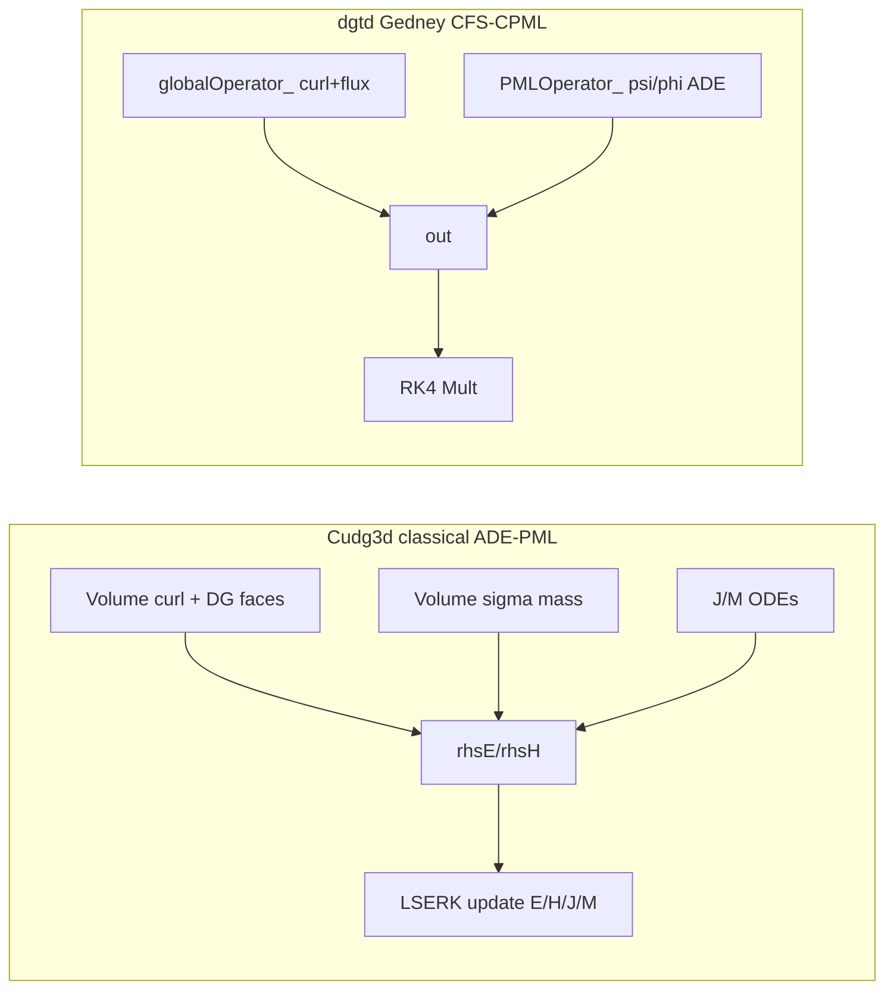

# Cudg3d vs dgtd PML — exploration and feasibility (2026-09-07)

Comparison of the archived OpenSEMBA DGTD solver under [`external/Cudg3d/`](../../external/Cudg3d/) against dgtd’s volumetric CFS-CPML path. Goal: see whether Cudg3d’s PML is an easy port, and what (if anything) transfers under the locked Gedney CFS decision ([`00-decisions-locked.md`](./00-decisions-locked.md)).

**Verdict:** Cudg3d uses **classical ADE polarization-current PML** (\(J\)/\(M\) + volume \(\sigma\)), **not** Gedney CFS-CPML \(\psi\). That makes its discrete scheme simpler — and **not** a drop-in for dgtd. Keep CFS; steal design lessons only.

---

## What Cudg3d is

Historical tetrahedral DGTD snapshot ([OpenSEMBA/Cudg3d lineage](https://github.com/lmdiazangulo/Cudg3d)). Most of the DG/PML/integrator stack is **commented out**. Treat as formulation archaeology, not a runnable Maxwell+PML build. Live scraps: Jacobi polynomials, `Options`, thin solver stubs. Submodule `external/opensemba` is empty.

| Path | Role |
|------|------|
| [`src/core/integrator/`](../../external/Cudg3d/src/core/integrator/) | LSERK4, LF2 |
| [`src/core/dg/Explicit.{h,cpp}`](../../external/Cudg3d/src/core/dg/Explicit.cpp) | Spatial DG Maxwell (`DGExplicit`) |
| [`src/core/dg/dispersive/`](../../external/Cudg3d/src/core/dg/dispersive/) | Volume dispersive + **PML** + SIBC |
| [`src/core/Options.*`](../../external/Cudg3d/src/core/Options.h) | Upwinding, LSERK, PML \(\sigma\) options |

### Evolution (no MFEM `Mult()`)

LSERK4 ([`IntegratorLSERK.cpp`](../../external/Cudg3d/src/core/integrator/IntegratorLSERK.cpp)):

```text
computeRHS → addRHSToRes(rka, dt) → updateFieldsWithRes(rkb)
```

Spatial RHS design ([`Explicit.cpp`](../../external/Cudg3d/src/core/dg/Explicit.cpp), mostly commented):

```text
volume curls (Cx,Cy,Cz) → face jumps → LIFT fluxes → scale 1/ε, 1/μ
```

No assembled global sparse operator.

### Field state

- Separate `FieldR3 E`, `FieldR3 H` (size `nK×np` per component) — **not** one `[Ex…Hz]` block.
- Residuals `resE`/`resH`, RHS `rhsE`/`rhsH`, face jumps `dE`/`dH`.
- PML auxiliaries live **on dispersive objects**, not in the primary ODE vector.

### PML formulation (critical)

**Not CFS-CPML.** Classical / UPML-like **ADE polarization currents**:

| Piece | Cudg3d |
|-------|--------|
| Aux | `J`, `M` (uniaxial: one scalar each; multi-axis: `FieldR3`) |
| \(\kappa\), \(\alpha\), \(\psi\) | **Absent** |
| Face PML | `DGPML::addJumps` is **empty** |
| Volume | \(\sigma\)-mass (constant or geometric \(\sigma\propto((x-x_0)/w)^2\)) |

Uniaxial stretch-axis design (commented bodies in [`PMLUniaxial.hpp`](../../external/Cudg3d/src/core/dg/dispersive/PMLUniaxial.hpp)):

```text
∂t E₁ += ε₀ σ E₁ − ε₀ J
∂t E₂,₃ −= ε₀ σ E₂,₃
∂t J = σ² E₁ − σ J
(same pattern for H/M with μ₀)
```

Hierarchy:

```text
DGDispersive
 └── DGPML
      ├── DGPMLUniaxial → DGPMLx/y/z
      └── DGPMLMultiaxial → biaxial / triaxial corners
```

Orientation tagged via `PMVolumePML`. Vacuum–PML faces use ordinary interior DG fluxes; upwinding is global (`Options::upwinding_`).

**Wiring gap:** `computePolarizationCurrentsRHS*` is defined but **never called** from the archived LSERK/`computeRHS` path — incomplete as checked out.



---

## What dgtd does today

Locked: **volumetric Gedney ADE CFS-CPML** in **`GlobalEvolution` only**.

| Piece | dgtd |
|-------|------|
| State | `[Ex…Hz \| ψ]` extended ODE; `n_aux = 6×ndofs × (# stretch dirs)` ([`PMLAuxLayout.h`](../../src/components/PMLAuxLayout.h)) |
| Curl | Assembled `globalOperator_` |
| ADE | Separate `PMLOperator_`: decay + driver \(D(F)\) + field corr |
| 1D | ψ-form: \(\sigma/\kappa\)-weighted vol+face, corr \(1/\kappa\) — **PASS −40 dB** ([session 21](./21-session-1d-solidification.md)) |
| 2D | φ-form + faces; **centered PASS**; **upwind late FAIL** ([session 25](./25-session-2d-order-upwind-centered.md)) |
| Hard part | Discrete stretch derivative into \(\psi/\varphi\) must match Maxwell’s \(D\) |

`Mult()` ([`GlobalEvolution.cpp`](../../src/evolution/GlobalEvolution.cpp)): SGBC → pack+MPI → `globalOperator_->Mult` → `PMLOperator_->AddMult` → TFSF.

---

## Similarities vs differences

**Similar**

- Attribute-tagged volumetric PML regions
- Explicit RK-family time stepping with auxiliaries advanced with the fields
- Uniaxial / multi-axis stretch orientation
- Vacuum–PML interface uses ordinary interior DG fluxes (Cudg3d explicitly; dgtd intended)

**Different (why “easy copy” fails)**

| | Cudg3d | dgtd |
|--|--------|------|
| Physics | Classical \(\sigma\) + \(J\)/\(M\) | Gedney CFS \(\psi\) (\(\kappa\), \(\alpha\)) |
| Needs discrete \(\partial\) on fields for aux? | **No** | **Yes** \((\sigma/\kappa)D(F)\) |
| Operator style | Dense elemental matvecs | Global sparse MFEM CSR |
| Aux storage | Side objects on tagged elems | Global \(\psi\) blocks |
| Face ADE | None | SBP faces required for absorption |

Cudg3d is “easy” because **it never builds a stretch-derivative ADE driver**. That is exactly where dgtd’s 2D pain lives (driver↔corr spectrum, upwind Zero/Two mismatch — sessions [23](./23-session-2d-closed-loop-spectrum.md)–[25](./25-session-2d-order-upwind-centered.md)).

---

## Feasibility under the locked CFS decision

**No drop-in Cudg3d port.** Copying \(J\)/\(M\) would reopen [`00-decisions-locked.md`](./00-decisions-locked.md) and abandon Gedney CFS.

**Recommended stance:** treat Cudg3d as a **design lesson**, not a code transplant.

| Idea from Cudg3d | Transfer to dgtd CFS? | Notes |
|------------------|----------------------|-------|
| Volume-only \(\sigma\) coupling (no face ADE) | Partial | Matches “empty `addJumps`”; Gedney still needs a consistent \(D\) for \(\psi\) |
| Same curl+flux RHS for vacuum and PML | **Yes — high leverage** | Analog: reuse `globalOperator_` directional blocks for the ADE driver |
| Aux only on tagged elements | Optional | Cuts `n_aux`; does not fix spectrum |
| Marker-based \(\sigma\)-weighted Zero/Two on ADE alone | **No** | Already hurts 1D DFT ([session 21](./21-session-1d-solidification.md)) |

**If classical ADE-PML is ever unlocked:** a Cudg3d-like plugin (volume \(\sigma\) + \(J\)/\(M\) on tagged elems, empty face jumps) would be the *structurally* easy MFEM port — a product decision, not a CFS shortcut.

---

## Next CFS follow-up (shared discrete \(D\))

Not implemented in this exploration. Captured here so the next coding session has a crisp brief.

### Problem

ADE \(\varphi/\psi\) driver is assembled as **centered SBP** (volume \(\pm\) OneNormal). Global Maxwell with `upwind_alpha>0` adds Zero/Two that the ADE never sees → late 2D blow-up on upwind slabs ([session 25](./25-session-2d-order-upwind-centered.md)). Centered cases pass because both operators share the same \(D\).

### Target fix

Reuse **`globalOperator_`’s directional derivative blocks** (including Zero/Two when `upwind_alpha>0`) as the stretch driver inside `PMLOperator_`, instead of reassembling a centered-only SBP in [`DGOperatorFactory.h`](../../src/components/DGOperatorFactory.h) `collectPMLOperatorBlocks`.

### Scope sketch

1. Identify which assembled sub-blocks of `buildGlobalOperator` already implement the stretch-direction derivative used by Maxwell curl.
2. Wire those (or `buildByMult` of the same weak forms) into the ADE driver path for dim≥2, keeping φ-form \(\sigma\) in SPD mass/corr.
3. Ablate: CSR Re(\(\lambda\)) on `2D_PML_X_slab` (upwind); T=20 DFT gate vs centered baseline.
4. Smoke `1D_PML_DFT` (must stay ≪ −40 dB).
5. **Do not** re-enable marker-based ADE Zero/Two.

### Effort

Medium. Highest leverage for “upwind 2D that absorbs and stays stable” without changing CFS physics.

---

## Key file map

| Role | Absolute / repo path |
|------|----------------------|
| Cudg3d uniaxial ADE | [`external/Cudg3d/src/core/dg/dispersive/PMLUniaxial.hpp`](../../external/Cudg3d/src/core/dg/dispersive/PMLUniaxial.hpp) |
| Cudg3d PML base | [`external/Cudg3d/src/core/dg/dispersive/PML.h`](../../external/Cudg3d/src/core/dg/dispersive/PML.h) |
| Cudg3d LSERK | [`external/Cudg3d/src/core/integrator/IntegratorLSERK.cpp`](../../external/Cudg3d/src/core/integrator/IntegratorLSERK.cpp) |
| dgtd Mult + PML apply | [`src/evolution/GlobalEvolution.cpp`](../../src/evolution/GlobalEvolution.cpp) |
| dgtd PML assembly | [`src/components/DGOperatorFactory.h`](../../src/components/DGOperatorFactory.h) |
| dgtd ψ layout | [`src/components/PMLAuxLayout.h`](../../src/components/PMLAuxLayout.h) |
| Locked CFS decisions | [`docs/pml/00-decisions-locked.md`](./00-decisions-locked.md) |
