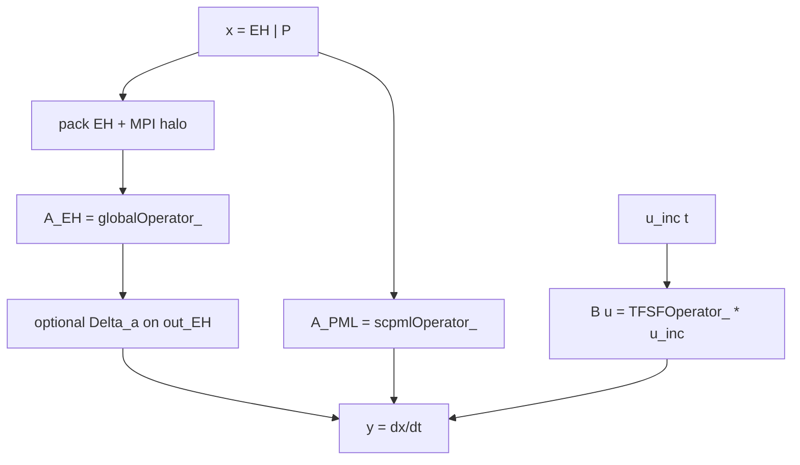
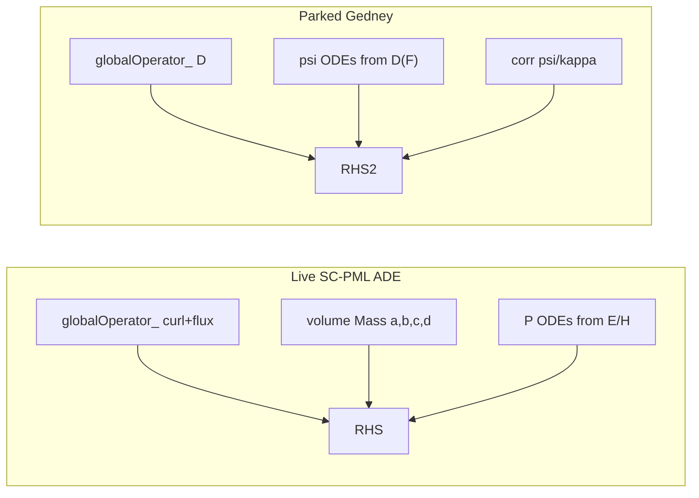

# SC-PML status report (2026-09-10)

**Audience:** anyone picking up volumetric PML in dgtd.  
**Live code path:** Bagci/Chen **stretched-coordinate ADE** (`P_E`/`P_H`).  
**Not live:** Gedney CFS \(\psi\sim D(F)\) (parked twice — see [`27-gedney-cfs-paused.md`](./27-gedney-cfs-paused.md)).

Companion docs: formulation detail [`30-sc-pml-ade.md`](./30-sc-pml-ade.md), literature shortlist [`29-dgtd-pml-approaches.md`](./29-dgtd-pml-approaches.md), locked decisions [`00-decisions-locked.md`](./00-decisions-locked.md).

---

## 1. Current status (one paragraph)

Volumetric PML is **implemented and validated** in `GlobalEvolution` as a field-driven ADE on top of the usual DG Maxwell operator. Attribute-tagged Gmsh volumes + JSON `"type": "PML"` define regions; profiles \(\sigma(\rho)\), \(\kappa(\rho)\) are QP-graded; auxiliaries \(P_E,P_H\) sit in an extended RK4 state. Plane-wave slabs pass the −40 dB DFT gate; the 2D dipole grading sweep (`2D_Dipole_PML_GO*`) shows **~50–60 dB better late-time reflection than SMA-only** `2D_Dipole` at the same probe locations. CFS frequency shift \(\alpha\) and Gedney stretch-derivative \(\psi\) are **not** in the tree.

| Check | Result |
|-------|--------|
| `1D_PML` DFT (\(E_y\)) | ≈ −55 dB (PASS ≤ −40) |
| `1D_PML_kappa` (\(\kappa_{\max}=2\)) | ≈ −42 dB (PASS) |
| `2D_PML_X_slab` upwind | Late-stable |
| Dipole SMA vs PML GO0–GO3 | See §8 |

---

## 2. Base Maxwell: how dgtd builds the curl operator

Normalized vacuum Maxwell (no PML) is the first-order system

\[
\partial_t\mathbf{E}=\nabla\times\mathbf{H},\qquad
\partial_t\mathbf{H}=-\nabla\times\mathbf{E}.
\]

In dgtd this is **not** a nodal LIFT stencil. It is an **assembled sparse DG operator** on MFEM, built once in `DGOperatorFactory::buildGlobalOperator()` and applied every RK stage as `globalOperator_->Mult(...)`.

### 2.1 State layout (fields only)

Six scalar DG unknown blocks on the same `ParFiniteElementSpace`:

\[
x_{\mathrm{EH}}
=
\bigl[E_x\,|\,E_y\,|\,E_z\,|\,H_x\,|\,H_y\,|\,H_z\bigr]
\in\mathbb{R}^{6N}.
\]

(With MPI face neighbors the *input* to `Mult` is padded to \(6(N+N_{\mathrm{nbr}})\); the *output* RHS is always length \(6N\).)

### 2.2 Mass and inverse mass

For each field type \(f\in\{E,H\}\), material \(\varepsilon\) or \(\mu\) enters a piecewise constant coefficient. The Galerkin mass is

\[
M_f[i,j]=\int_\Omega \varepsilon_f\,\phi_i\phi_j\,dV
\]

(\(\varepsilon_E=\varepsilon\), \(\varepsilon_H=\mu\)). dgtd stores the **element-local inverse** via MFEM `InverseIntegrator(MassIntegrator(...))`:

```text
buildInverseMassMatrixSubOperator(f)
  → InverseIntegrator(MassIntegrator(PWConst(ε or μ)))
```

Call that \(M_f^{-1}\). Almost every volume or face form is then left-multiplied by \(M_f^{-1}\) with `buildByMult(MInv, WeakForm)` so the assembled blocks already produce \(\partial_t\) (strong form), not a mass-weighted residual.

### 2.3 Directional volume curl — `Derivative`

Weak \(\partial/\partial x_d\) is `DerivativeIntegrator` along direction \(d\). After \(M^{-1}\):

\[
D_d^{(f)} \;=\; M_f^{-1}\,(\text{Derivative}(d)).
\]

`collectGlobalDirectionalOperators` places these into the global \(6\times 6\) block matrix with the usual curl index pattern (and a sign that flips with field type), skipping \(d\ge\) mesh dimension so 1D/2D stay dimension-agnostic.

### 2.4 Face coupling — Zero / One / Two normals

Interior and boundary faces use numerical fluxes. After DG integration by parts, the face terms involve the outward normal \(\mathbf{n}\) contracted zero, one, or two times with the jump/average of the fields. In code:

| Builder | Role (schematic) |
|---------|------------------|
| `ZeroNormal` | Penalty / jump terms \(\sim \llbracket F\rrbracket\) (no free \(n\) left) — upwind dissipation when `upwind_alpha>0` |
| `OneNormal` | Centered flux pieces \(\sim n\cdot(\cdot)\) completing the discrete curl on faces |
| `TwoNormal` | Upwind anisotropic pieces \(\sim n_i n_j\) (scaled by `upwind_alpha`) |

Each is assembled as a face bilinear form, then again composed with \(M^{-1}\). IBFI variants exist for interior-boundary faces (TFSF contour, SGBC, …).

`buildGlobalOperator` merges, in order:

```text
IBFI One / Zero / Two   (if interior BCs)
+ Directional Derivative
+ OneNormal
+ ZeroNormal
+ TwoNormal
+ bulk conductivity Mass(σ_bulk)   (ordinary lossy media, not PML)
→ mergeBlocksToCSR → globalOperator_   (= A_EH below)
```

So the discrete vacuum (or material) Maxwell RHS is

\[
\dot x_{\mathrm{EH}}
=
A_{\mathrm{EH}}\,x_{\mathrm{EH}}^{\mathrm{(local+nbr)}},
\]

with \(A_{\mathrm{EH}}\) already including \(M^{-1}\) on every block.

### 2.5 How that inspired the PML operator

Two design rules fell out of this architecture:

1. **Anything that is a volume constitutive / ADE term should look like conductivity:** assemble `Mass(coeff)` on marked PML attributes, left-multiply by the same \(M^{-1}\) (or \(M_a^{-1}\) when \(\kappa>1\)), place blocks with `collectBlockPlacement` / `mergeBlocksToCSR`. That is exactly how `collectGlobalConductiveOperator` already treats bulk \(\sigma\).

2. **Do not rebuild curl+flux for PML.** Face Zero/One/Two and volume Derivative stay exclusively in `globalOperator_`. A Gedney-style \(\psi\leftarrow D(F)\) would need a *second* copy of those directional/face forms, forced to match `upwind_alpha` — that is where earlier CFS attempts broke. Field-driven SC-PML only needs volume masses of \(b,c,d,1/\kappa\), so it **rides beside** \(A_{\mathrm{EH}}\) instead of forking Maxwell’s discrete \(D\).

---

## 3. LTI view: Maxwell + TFSF, then where PML plugs in

### 3.1 Maxwell + TFSF as \(y = A x + B u\)

Without PML, one RK stage of `GlobalEvolution::Mult` is linear time-invariant in the fields:

\[
\underbrace{\dot x_{\mathrm{EH}}}_{y}
=
\underbrace{A_{\mathrm{EH}}}_{A}\,
\underbrace{x_{\mathrm{EH}}^{\mathrm{(packed)}}}_{x}
+
\underbrace{B_{\mathrm{TFSF}}}_{B}\,
\underbrace{u_{\mathrm{inc}}(t)}_{u}.
\]

| Symbol | Code | Meaning |
|--------|------|---------|
| \(x\) | `multWorkVec_` | Local \(E/H\) DOFs + face-neighbor halo |
| \(A\) | `globalOperator_` | Sparse DG Maxwell (Derivative + Zero/One/Two + …) |
| \(u\) | planewave / dipole fields on TFSF faces | Incident trace evaluated at stage time |
| \(B\) | `TFSFOperator_` | Same *face* flux machinery as a source contour (`buildSourceFaceOperator`), restricted to `TotalFieldIn` |
| \(Bu\) | `TFSFOperator_->AddMult(..., out, -1.0)` | Injects \(\mp\) the numerical flux of the incident field (TF/SF split) |

So TFSF is **not** a volume forcing; it is an extra face operator applied to an *evaluated* incident vector, added after \(A x\).

Dipole sources used in the GO sweep are total-field style on tagged faces; the same Mult skeleton applies (with or without a separate TFSF planewave block depending on the case).

### 3.2 Extended state with PML

With SC-PML the ODE state grows:

\[
x
=
\begin{bmatrix} x_{\mathrm{EH}} \\ x_{P} \end{bmatrix}
=
\begin{bmatrix} E \\ H \\ P_E \\ P_H \end{bmatrix}
\in\mathbb{R}^{6N+6N},
\]

and the homogeneous part becomes block-structured:

\[
\dot x
=
\begin{bmatrix}
A_{\mathrm{EH}} + A_{\mathrm{EH}\leftarrow\mathrm{EH}}^{\mathrm{PML}}
&
A_{\mathrm{EH}\leftarrow P}^{\mathrm{PML}} \\[4pt]
A_{P\leftarrow\mathrm{EH}}^{\mathrm{PML}}
&
A_{P\leftarrow P}^{\mathrm{PML}}
\end{bmatrix}
x
+
\begin{bmatrix} B_{\mathrm{TFSF}} \\ 0 \end{bmatrix} u.
\]

In code that split is **not** one giant merged matrix. It is applied as:

```text
out_EH  =  globalOperator_ * x_packed          # A_EH x
out_EH +=  Δ_a * out_EH     (optional, κ>1)   # left-multiply curl by a^{-1} on PML
out     +=  scpmlOperator_ * x_full            # all PML blocks (EH↔EH, EH↔P, P↔EH, P↔P)
out_EH  +=  TFSFOperator_ * u_inc   (scale -1) # B u  (fields only)
```

So schematically

\[
y
=
\underbrace{
\begin{bmatrix} A_{\mathrm{EH}} & 0 \\ 0 & 0 \end{bmatrix}
}_{\texttt{globalOperator\_ (on EH)}}
x
\;+\;
\underbrace{A_{\mathrm{PML}}}_{\texttt{scpmlOperator\_}}
x
\;+\;
\underbrace{B u}_{\texttt{TFSF}},
\]

with an optional post-processing \(\Delta_a\) on the curl contribution when \(\kappa_{\max}>1\) (equivalent to replacing \(M^{-1}\) by \(M_a^{-1}\) on PML for that piece without touching faces).

**Important properties of this plug-in:**

- \(A_{\mathrm{PML}}\) is **volume-only** (marked PML attributes). Vacuum DOFs are unchanged by the ADE blocks.
- \(A_{\mathrm{PML}}\) acts on the **full** extended vector; \(A_{\mathrm{EH}}\) and \(B\) only touch the first \(6N\) rows.
- RK4 sees one `TimeDependentOperator::Mult`; auxiliaries advance with the same stages as the fields (true ADE, not a lagged convolution update).
- Probes / ParaView still read only \(x_{\mathrm{EH}}\).



---

## 4. Physics: why a PML, and what “stretch” means

Open Maxwell problems need a finite mesh. A **perfectly matched layer** is a thin absorbing shell around the domain of interest. In the continuous model it is reflectionless for any angle/frequency (ideal profiles); in discrete DG we approximate that with graded conductivity and enough thickness.

**Stretched coordinates (SC).** In the PML, derivatives along a stretch axis \(u\) are replaced by

\[
\partial_u \;\longrightarrow\; \frac{1}{s_u}\partial_u,\qquad
s_u = \kappa_u + \frac{\sigma_u}{j\omega}
\]

(normalized \(\varepsilon_0=1\); CFS would add \(\alpha_u\) in the denominator — deferred). Here:

| Symbol | Role |
|--------|------|
| \(\sigma_u\ge 0\) | Absorption; grows with depth into the layer |
| \(\kappa_u\ge 1\) | Extra scaling; helps evanescent / grazing waves |
| \(\alpha_u\ge 0\) | CFS pole shift (not wired yet; JSON must stay `alpha_max: 0`) |

At the vacuum–PML interface one wants \(\sigma=0\), \(\kappa=1\) so the medium matches free space.

**ADE (auxiliary differential equation).** Frequency-domain \(1/s_u\) becomes a rational function of \(j\omega\). Instead of storing a convolution history (CPML), one introduces **memory variables** \(P\) that obey first-order ODEs in time. Those ODEs ride in the same RK4 `Mult()` as \(E\) and \(H\).

**What we absorb.** For a z-directed dipole in 2D, the radiated electric field is mainly \(E_z\). Waves hit side slabs (uniaxial \(X\) or \(Y\)) and corners (biaxial \(X{+}Y\)). SMA alone on the outer box still reflects; PML + SMA should leave a much smaller late return at interior probes.

---

## 5. Mathematics of the live formulation (Bagci / Chen SC-PML)

Normalized \(\varepsilon=\mu=1\). For each Cartesian component \(u\in\{x,y,z\}\) with cyclic partners \((u,v,w)\):

\[
\begin{aligned}
\partial_t (a\,E)_u &= (\nabla\times H)_u - b_{uu} E_u - c_{uu}(P_E)_u,\\
\partial_t (a\,H)_u &= -(\nabla\times E)_u - b_{uu} H_u - c_{uu}(P_H)_u,\\
\partial_t (P_E)_u &= \kappa_u^{-1} E_u - d_{uu}(P_E)_u,\\
\partial_t (P_H)_u &= \kappa_u^{-1} H_u - d_{uu}(P_H)_u.
\end{aligned}
\]

Diagonal tensors (inactive axes: \(\sigma=0\), \(\kappa=1\)):

\[
\begin{aligned}
a_{uu} &= \frac{\kappa_v\kappa_w}{\kappa_u},\\
b_{uu} &= \frac{\sigma_v\kappa_w + \sigma_w\kappa_v - a_{uu}\sigma_u}{\kappa_u},\\
c_{uu} &= \sigma_v\sigma_w - b_{uu}\sigma_u,\\
d_{uu} &= \frac{\sigma_u}{\kappa_u}.
\end{aligned}
\]

**Uniaxial \(\kappa\equiv 1\) limit** (CuDG3D-equivalent): with stretch only along \(s\) and \(J=\sigma_s^2 P_s\),

\[
\partial_t E_s += \sigma_s E_s - J_s,\quad
\partial_t E_\perp -= \sigma_s E_\perp,\quad
\partial_t J_s = \sigma_s^2 E_s - \sigma_s J_s
\]

(and likewise for \(H\)/\(M\)). So the live SC-PML **generalizes** the old classical \(J/M\) ADE; it does not discard it.

**Grading.** Depth \(\rho\) into a slab (or radial shell) of thickness \(L\), order \(m=\) `grading_order`:

\[
\xi=\mathrm{clamp}(\rho/L,0,1),\qquad
\sigma(\xi)=\sigma_{\max}\xi^{m},\qquad
\kappa(\xi)=1+(\kappa_{\max}-1)\xi^{m}
\]

(\(m=0\): constant \(\sigma=\sigma_{\max}\), \(\kappa=\kappa_{\max}\)). Design \(\sigma_{\max}\) from `target_reflection` (theoretical single-interface estimate), not from the measured DFT gate.

**Multi-axis.** Corners use `active_axes: ["X","Y"]`. Then both \(\sigma_x\) and \(\sigma_y\) are nonzero → \(c_{uu}\) couples auxiliaries the way a true biaxial stretch should (superposition of uniaxial stacks is the \(\kappa=1\) special case).

---

## 6. ADE vs Gedney — what we kept and what we threw away

Both are “ADE PMLs,” but they **drive auxiliaries differently**.

| | **Live SC-PML ADE** | **Gedney CFS ADE (parked)** |
|--|---------------------|-----------------------------|
| Auxiliaries | \(P_E,P_H\) (field-sized) | \(\psi^{E/H}\) per stretch dir × component |
| Driven by | **Fields** \(E,H\) | **Stretch derivatives** \(D_s(E)\), \(D_s(H)\) |
| Field update | Volume damping \(b,c\) + optional LHS \(a\) | Curl kept; add \(\pm\psi/\kappa\) corrections |
| Discrete risk | Matches MFEM mass/`AddMult` pattern | Must share Maxwell’s discrete \(D\) (incl. upwind Zero/Two) |
| Status in dgtd | **Default / only path** | Removed; archive in [`27`](./27-gedney-cfs-paused.md) |

Gedney is still the literature gold standard for CFS in high-order DG **when** the discrete stretch operator matches Maxwell. Two attempts here failed absorption or late-time stability (centered 1D DFT ~+28 dB on the last try). We stopped reintroducing \(\psi\sim D(F)\) and moved to field-driven SC-PML, which fits `globalOperator_` + volume `MassIntegrator` without a second curl chain.



---

## 7. How SC-PML is implemented in dgtd

### 7.1 Pipeline (runtime)

```text
JSON "type":"PML" + active_axes + grading
        → PMLProperties / PMLProfiles (σ,κ at QPs)
        → SCPMLLayout  (n_aux = 6N)
        → buildSCPMLOperators  (ADE CSR + optional curl Δ)
GlobalEvolution::Mult:
  1) globalOperator_  → ∂t E,H from DG curl+flux          (A_EH x)
  2) if κ_max>1: out_Fu += Δ_u out_Fu   (a-rescale on PML)
  3) scpmlOperator_.AddMult  → damping + P ODEs           (A_PML x)
  4) TFSF AddMult(u_inc)                                  (B u)
  5) SGBC flux if present
RK4 advances the full vector [E H | P_E P_H]
Probes / ParaView export only the first 6N (fields)
```

Key files:

| Piece | Location |
|-------|----------|
| Maxwell \(A_{\mathrm{EH}}\) | `DGOperatorFactory::buildGlobalOperator` |
| TFSF \(B\) | `buildTFSFGlobalOperator` / `applyTFSFSourceToVector` |
| Layout | [`src/components/SCPMLLayout.{h,cpp}`](../../src/components/SCPMLLayout.h) |
| Profiles | [`src/components/PMLProfiles.*`](../../src/components/PMLProfiles.h), [`PMLProperties.*`](../../src/components/PMLProperties.h) |
| \(A_{\mathrm{PML}}\) | `DGOperatorFactory::buildSCPMLOperators` in [`DGOperatorFactory.h`](../../src/components/DGOperatorFactory.h) |
| Time loop | [`GlobalEvolution.cpp`](../../src/evolution/GlobalEvolution.cpp) `Mult` |

### 7.2 Discrete steps for \(A_{\mathrm{PML}}\) (same vocabulary as Maxwell)

1. **Same FE space** for every Cartesian component of \(E\), \(H\), \(P_E\), \(P_H\).
2. **Tensor coefficients** at each QP from \((\sigma_x,\sigma_y,\sigma_z,\kappa_x,\kappa_y,\kappa_z)\) via `SCPMLTensorCoefficient` (`A,B,C,D,InvKappa`).
3. **Marked volume masses** on PML attributes only: \(\mathrm{Mass}(b)\), \(\mathrm{Mass}(c)\), … — same `MassIntegrator` path as bulk conductivity.
4. Compose with inverse mass like Maxwell: \(M^{-1}\mathrm{Mass}(\cdot)\) when \(\kappa\equiv 1\); \(M_a^{-1}\mathrm{Mass}(\cdot)\) on EH damping when \(\kappa_{\max}>1\).
5. **\(P\) rows** always use unit \(M^{-1}\) (no \(a\) on \(\partial_t P\)).
6. **Curl \(a\)-rescale** (only if some region has `kappa_max > 1`): after the global curl Mult,

\[
\mathrm{out}_{F_u} \mathrel{+}= (M_a^{-1}M - M^{-1}M)\,\mathrm{out}_{F_u}
\]

on PML DOFs, so the curl piece matches Bagci’s LHS \(a\) without rebuilding Zero/One/Two.
7. Vacuum–PML **numerical flux is still ordinary Maxwell** (Lu/Cai flux-with-aux not implemented).

### 7.3 JSON contract (dipole-style)

```json
{
  "type": "PML",
  "matches_vacuum": true,
  "grading_order": 2,
  "target_reflection": 1e-6,
  "kappa_max": 1.0,
  "alpha_max": 0.0,
  "active_axes": ["X", "Y"]
}
```

- `active_axes` **required** (uniaxial sides vs biaxial corners).
- `alpha_max` must be `0` until a CFS pole is added.
- Mesh owns thickness; JSON owns grading law.

---

## 8. Verification: dipole grading sweep vs SMA

### Setup

| Item | Value |
|------|--------|
| Mesh | `2D_Dipole_PML.msh` (vacuum \(\lvert x\rvert,\lvert y\rvert\lesssim 3\); PML to outer box \(\approx 4\)) |
| SMA baseline | `2D_Dipole` (same outer box, all vacuum + SMA) |
| PML cases | `2D_Dipole_PML_GO{0,1,2,3}` — `target_reflection=1e-6`, vary `grading_order` |
| Probes | X `(2.5,0)`, Y `(0,2.5)`, XY `(1.768,1.768)` |
| Component | \(E_z\) (z-dipole) |
| Incident window | Auto around first peak ≈ `[3.3, 4.1]` |
| Reflection window | After round-trip delay ≈ `[6.5, 16]` (`--ref-delay 3`) |
| Tool | [`scripts/dipole_pml_grading_dft.py`](../../scripts/dipole_pml_grading_dft.py) |
| Exports | `Exports/mpi-4/...` (MPI 4 run) |

### Results — \(R_{\mathrm{dB}}=20\log_{10}(|E_{\mathrm{ref}}|/|E_{\mathrm{inc}}|)\) at \(f_{\mathrm{peak}}\)

| Case | \(m\) | X | Y | XY |
|------|-------|---|---|-----|
| `2D_Dipole` (SMA only) | — | **−20.0** | −20.0 | −30.5 |
| `2D_Dipole_PML_GO0` | 0 | **−79.7** | −82.6 | −76.8 |
| `2D_Dipole_PML_GO1` | 1 | −72.4 | −72.6 | −82.3 |
| `2D_Dipole_PML_GO2` | 2 | −74.4 | −72.1 | −70.2 |
| `2D_Dipole_PML_GO3` | 3 | −74.0 | −70.9 | −73.7 |

**Takeaways**

- PML beats SMA by roughly **50–60 dB** on axis probes for this mesh and design \(R\).
- At fixed `target_reflection=1e-6`, **flat σ (`grading_order: 0`) was best on X/Y**; higher \(m\) did not clearly improve this particular geometry (σ profile and \(\sigma_{\max}\) both change with \(m\)).
- Late envelopes: SMA keeps \(\lvert E_z\rvert\sim 10^{-2}\) after \(t\sim 6.5\); PML drops to \(\sim 10^{-3}\)–\(10^{-4}\).

Replay:

```sh
python3 scripts/dipole_pml_grading_dft.py \
  Exports/mpi-4/2D_Dipole \
  Exports/mpi-4/2D_Dipole_PML_GO{0,1,2,3}
```

---

## 9. What is done vs what is still open

**Done**

- SC-PML ADE wired end-to-end (layout, profiles, operator, Mult, JSON).
- \(\kappa>1\) path (MaInv + curl Δ).
- 1D/2D slab gates; dipole multi-axis late-stable; GO vs SMA DFT table.
- Gedney code and `pml_formulation` switch removed.

**Open / deferred**

- CFS \(\alpha\) pole on \(d\) (JSON rejects `alpha_max > 0`).
- Lu/Cai / Peng **flux treatment of auxiliaries** at vacuum–PML faces.
- Systematic \(\kappa_{\max}\) tuning on the dipole (beyond the 1D kappa gate).
- Do **not** revive Gedney \(\psi\sim D(F)\) without a new discrete-\(D\) design review.

---

## 10. References

1. L. Chen, M. B. Özakin, S. Ahmed, H. Bağcı, *A memory-efficient implementation of PML with smoothly-varying coefficients in DGTD*, arXiv:2006.02551 — SC-PML ADE eqs. used here.
2. S. D. Gedney, B. Zhao, *An ADE formulation for the CFS-PML*, IEEE TAP 58(3), 2010 — CFS / \(\psi\) form; **not** the live path.
3. T. Lu, P. Zhang, W. Cai, *DG methods for dispersive/lossy Maxwell and PML*, JCP 2004 — UPML ADE + Riemann with polarization (possible future face upgrade).
4. OpenSEMBA Cudg3d classical \(J/M\) ADE — \(\kappa\equiv 1\) limit; see [`26-cudg3d-pml-comparison.md`](./26-cudg3d-pml-comparison.md).
